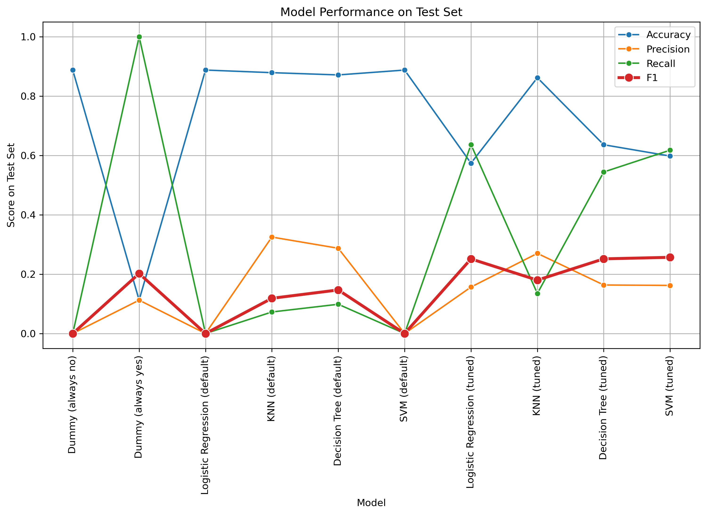

## Repository: UCB\_Required\_Assignment17\_1

### Assignment: UCB AI/ML Course Required Assignment 17.1

### Author: Bart Rothwell

### Date: 2/5/2026

This README file summarizes the findings of a comparison of four classification models (Logistic Regression, K Nearest Neighbors, Decision Trees, and Support Vector Machines) on the task of predicting the outcome of a bank marketing campaign in which bank clients are contacted to see if they will subscribe to a term deposit.

Link to Jupyter Notebook with the full analysis: https://github.com/bartrothwell/UCB_Required_Assignment17_1/blob/main/RequiredAssignment17_1_Rothwell.ipynb

#### Plot of Primary Findings:

#### Summary of Findings

* The primary finding from this analysis is summarized in the plot above, which shows that with tuned hyperparameters, three of the classifiers achieve about the same F1 score of 0.25: Logistic Regression, Decision Tree, and SVM. However the Decision Tree classifier has a lower Recall score than the other two (0.54 vs. 0.64 for Logistic Regression and 0.62 for SVM), and since the criterion of importance is probably to not miss out on customers who might subscribe to a deposit (i.e. fewer false negatives), Decision Trees will probably not be the best approach. Between Logistic Regression and SVM, Logistic Regression has the advantage of being faster to train, and it also has a slightly higher Recall score than SVM, so Logistic Regression comes out as the winner in this analysis, catching 64% of the actual positive cases in the test set, which represent only 11% of of the test set samples. It does so with 57% overall accuracy, which is pretty good considering the high Recall score.
* The analysis also shows by far the most important feature that determines whether a customer will subscribe to a deposit is whether they have credit in default, with 'yes' resulting in less likelihood of subscribing than 'no'. The type of job the customer has is the next most important factor, with certain job categories (e.g. 'student' and 'retired') resulting in a much higher likelihood, and others (e.g. entrepreneur) resulting in a lower likelihood. Other factors, like education and age, seem to have less of an impact.

#### Recommendations

* Based on this analysis, I recommend that the tuned Logistic Regression model be used for screening which individuals to contact, because eliminating false negatives (while not contacting every single individual) is of most importance, so the F1 score is the most important performance metric, and the tuned Logistic Regression model produces the best F1 score. Looking inside the tuned model, we see that contacting clients who have credit in default is probably not worthwhile, and clients who are students or are retired are better candidates to contact than those who are entrepreneurs.
